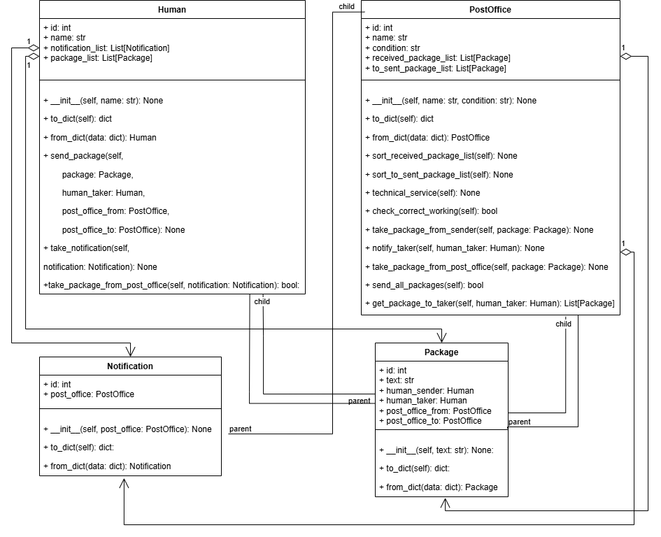
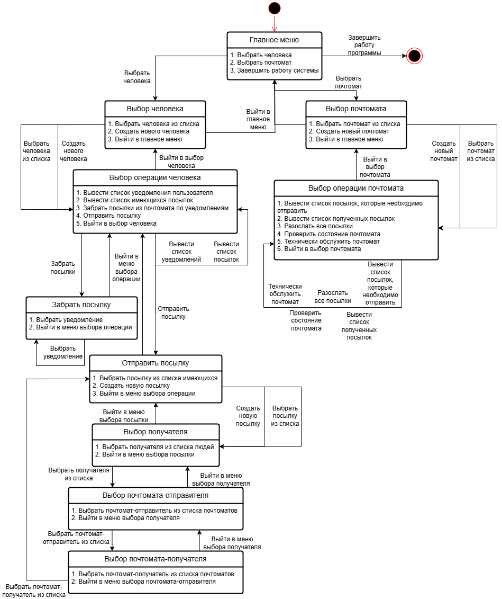

# Лабораторная работа №1
## Модель почтомата
Предметная область: автоматизированные пункты выдачи и приема почтовых отправлений.

Важные сущности: почтомат, почтовые отправления, получатель, отправитель, уведомление.

Операции: операция отправки почтовых отправлений, операция получения посылок из почтомата, операция уведомления получателя, операция технического обслуживания почтомата, операция обеспечения безопасности.

## Объектно-ориентированный анализ
### Выделение сущностей
PostOffice: почтомат-отправитель, почтомат-получатель

Human: отправитель, получатель

Package: посылка

Notification: уведомление
### Определение атрибутов и методов
#### PostOffice
- Атрибуты:
  1. Имя (name)
  2. Список полученных посылок (received_package_list)
  3. Список посылок, которые необходимо отправить (to_sent_package_list)
  4. Состояние (condition)
- Методы:
  1. сортировать список полученных посылок (sort_received_package_list)
  2. сортировать список посылок, которые необходимо отправить (sort_to_sent_package_list)
  3. операция техничесго обслуживания (technical_service)
  4. операция проверки состояния почтомата (check_correct_working)
  5. принять посылку от отправителя (take_package_from_sender)
  6. уведомить получателя (notify_taker)
  7. принять посылку из почтомата (take_package_from_post_office)
  8. разослать все посылки (send_all_packages)
  9. отдать посылки получателю (get_package_to_taker)
#### Human
- Атрибуты:
  1. Имя (name)
  2. Список уведомлений (notification_list)
  3. Список посылок (package_list)
- Методы:
  1. отправить посылку (send_package)
  2. принять уведомление (take_notification)
  3. получить посылку из почтомата по уведомлению (take_package_from_post_office)
#### Package
- Атрибуты:
  1. Текст (text)
  2. Отправитель (human_sender)
  3. Получатель (human_taker)
  4. Почтомат-отправитель (post_office_from)
  5. Почтомат-получатель (post_office_to)
- Методы: отсутствуют
#### Notification
- Атрибуты:
  1. Почтомат (post_office)
- Методы: отсутствуют
### Определение связей
#### PostOffice
- Ассоциации:
  1. <-> PostOffice (принимает и отправляет посылки)
  2. <-> Human (забирает и приносит посылки)
  3. -> Package (принимает и отдает их)
  4. -> Notification (отправляет их)
- Агрегации:
  1. -> Package (хранит их)
  2. -> Notification (создает их)
#### Human
- Ассоциации:
  1. <-> PostOffice (забирает и приносит ему посылки)
  2. -> Package (забирет и приносит их)
  3. -> Notification (получает их)
- Агрегации:
  1. -> Package (хранит их)
  2. -> Notification (хранит их)
#### Package
- Ассоциации:
  1. <- PostOffice (принимается и отправляется им)
  2. <- Human (забирается и относится им)
- Агрегации:
  1. <- PostOffice (хранится им)
  2. <- Human (хранится им)
#### Notification
- Ассоциации:
  1. <- PostOffice (отправляется им)
  2. <- Human (принимается им)
- Агрегации:
  1. <- PostOffice (создается им)
  2. <- Human (хранится им)
## Построение диаграммы классов и состояний
Диаграмма классов:

Диаграмма состояний:

## Разработка программной системы на Python
Реализованная система лежит в папке [Открыть текущую папку](./src)
